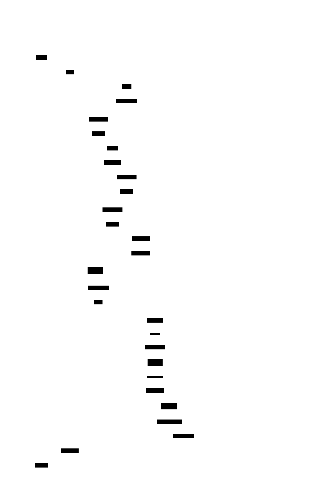

# pi-hifi: A Verification-Centric Inference-Time Reasoning Layer for the Pi Coding Agent

> An open-source replication of the inference-time portion of the **Apodex-1.0**
> verification-centric agent-team method, packaged as an extension for the
> [Pi coding agent](https://github.com/badlogic/pi-mono). The pipeline raises
> answer reliability on hard engineering tasks - system design, non-trivial
> code, incident diagnosis - by structuring inference as a small agent team
> with execution-grounded selection and independent, fresh-context
> verification, rather than a single forward pass.

**Status:** working v1; measured results below.
**Engine-agnostic:** runs on whatever model the Pi session is using; every role is configurable.

---

## Abstract

Single-pass LLM generation fails unpredictably on engineering tasks: answers
pattern-match the surface of a problem, assert correctness that was never
observed, and omit failure modes that a rubric of professional practice would
demand. Apodex-1.0 (Apodex Team, 2026) attributes reliability gains on
deep-research benchmarks not to larger models but to a *team that audits its
own conclusions before committing*. We replicate the inference-time portion of
that method as a reusable extension for the Pi coding agent: (i) parallel
candidate sampling with **causal-evidence selection** - candidates' own
self-tests are executed locally and a pairwise judge scores comprehension,
causality, and empirical grounding; (ii) a **generate-verify-revise (GVR)**
loop in which an independent grader, in a fresh context that never sees the
author's reasoning, returns a numeric score *and a written critique* that
steers the next revision, with verbatim failing-test output piped to the
reviser and a deterministic score cap on observed-broken code; (iii)
**claim-level external verification** - the answer is decomposed into atomic
claims, each audited independently against the task materials and execution
evidence; and (iv) **evidence-disciplined assembly** of the final answer from
audited atoms. On a 9-task suite spanning design, code, and incident diagnosis,
the pipeline lifts a weak engine (deepseek-v4-flash in all heavy roles) from
0.96 to **1.00** overall (design bucket: 0.89 -> **1.00**), matching the strong
engine's single-pass quality at roughly twice the cost of one strong-engine
pass (~$0.016/task). On the strong engine (deepseek-v4-pro) the suite is
saturated (0.99 -> 0.99); we report this null result as-is. All 9,000+ LLM
sub-calls behind these numbers are persisted as auditable artifacts.

---

## Table of Contents

- [1. Introduction](#1-introduction)
- [2. Background and Original Research](#2-background-and-original-research)
- [3. Method](#3-method)
  - [3.1 Architecture](#31-architecture)
  - [3.2 Context Isolation](#32-context-isolation)
  - [3.3 Stage 1 - Candidate Sampling and Causal-Evidence Selection](#33-stage-1--candidate-sampling-and-causal-evidence-selection)
  - [3.4 Stage 2 - Generate-Verify-Revise](#34-stage-2--generateverifyrevise)
  - [3.5 Stage 3 - Claim-Level External Verification](#35-stage-3--claim-level-external-verification)
  - [3.6 Stage 4 - Evidence-Disciplined Assembly](#36-stage-4--evidence-disciplined-assembly)
  - [3.7 Budgets, Determinism, and Auditability](#37-budgets-determinism-and-auditability)
- [4. Experimental Methodology](#4-experimental-methodology)
  - [4.1 Task Suite](#41-task-suite)
  - [4.2 Protocol](#42-protocol)
  - [4.3 Scoring](#43-scoring)
  - [4.4 Threats to Validity](#44-threats-to-validity)
- [5. Results](#5-results)
  - [5.1 Main Results](#51-main-results)
  - [5.2 Iterative Failure Analysis](#52-iterative-failure-analysis)
- [6. Discussion and Limitations](#6-discussion-and-limitations)
- [7. Installation and Usage](#7-installation-and-usage)
  - [7.1 One-Line Installation](#71-one-line-installation)
  - [7.2 Invocation](#72-invocation)
  - [7.3 Configuration](#73-configuration)
  - [7.4 Reproducing the Evaluation](#74-reproducing-the-evaluation)
- [8. Repository Structure](#8-repository-structure)
- [9. Future Work](#9-future-work)
- [10. References](#10-references)

---

## 1. Introduction

The dominant interaction pattern with coding agents is a single forward pass:
one model, one context, one answer. For hard engineering work this pattern has
a well-documented failure profile - *pseudo-correctness* (a patch that reads
as reasonable yet does not causally fix the bug), happy-path code, unverified
confidence, and design documents that omit exactly the failure modes a reviewer
would ask about. Recent test-time-compute literature (surveyed in
[`docs/research/test-time-boosting.md`](docs/research/test-time-boosting.md))
converges on two observations: *verification is easier than generation*, and
verification only pays when it is **external** (a fresh context, a different
role, ideally grounded in execution) rather than introspective self-review.

`pi-hifi` operationalizes these observations inside a daily-driver coding
agent. It is deliberately **not** a 150-agent datacenter swarm: it is a small,
budget-capped team (3-10 concurrent sub-calls) implemented as deterministic
control flow in TypeScript, where every probabilistic step is anchored by an
objective one - candidate self-tests are *executed*, not read; grader verdicts
are capped by observed runtime behavior; final claims are audited one by one.

Contributions:

1. A faithful, open, inference-time-only replication of the Apodex-1.0 team
   method (generate-verify-revise, causal-evidence candidate comparison,
   evidence-graph-style claim auditing) for an interactive coding agent.
2. An evaluation harness with deterministic hidden tests, locked design
   rubrics, and known-root-cause incidents, including a self-check that
   validates the hidden tests themselves and a post-run artifact analyzer.
3. Measured evidence for the central economic claim: a weak engine plus
   verification reaches strong-engine single-pass quality at a fraction of
   strong-engine pipeline cost (§5).

## 2. Background and Original Research

The method replicated here is described in:

> **Apodex Team (2026). "Apodex-1.0: A Verification-Centric Agent Team for
> Discoverative Intelligence."** Technical report.
> [Landing page](https://www.apodex.com/pdf/20260608) ·
> [PDF](https://framerusercontent.com/images/us2FrK69YXqcWwu2AAUVAVCnK0.pdf)

Apodex-1.0 deploys a trained model inside an asynchronous agent team with a
shared evidence pool and a global verifier; per-domain verification primitives
are *evidence reasoning over a claim graph* (deep research), *causal-evidence
comparison* (coding), and *generate-verify-revise* (mathematical proofs;
§4.1-4.3 of the report). Two design decisions from the report are load-bearing
for this replication: the in-loop grader is **never shown a reference solution
or grading key** (leakage turns the grader into an oracle), and the grader's
**written feedback** - not its scalar score - is what separates GVR from naive
best-of-K sampling. The report's §8.4 ablation (IMO-ProofBench Advanced:
12.38 -> 34.29 under GVR with K = 10) also predicts where inference-time
verification pays: on tasks where the base model's single-pass score is low -
a prediction our two-engine results in §5 directly confirm.

This repository replicates the *inference-time* mechanics only; the three-stage
post-training pipeline of the original is out of scope. The accompanying
literature survey ([`docs/research/test-time-boosting.md`](docs/research/test-time-boosting.md),
~130 sources, each load-bearing claim checked against its primary source)
positions the method within the 2024-2026 test-time-compute landscape.

## 3. Method

### 3.1 Architecture



*Figure 1: one task's path through the team. Stage 1 runs only in code mode
with N > 1; stages 2-4 run for every mode. Source: [`docs/diagrams/pipeline-sequence.d2`](docs/diagrams/pipeline-sequence.d2).*

Four LLM roles participate, each independently bindable to any
provider/model available to Pi:

| Role | Function | Default binding |
|---|---|---|
| `generator` | candidates, revisions, assembly | session-active model |
| `grader` | GVR scoring + written critique | session-active model |
| `verifier` | holistic external audit | session-active model |
| `worker` | mode classifier, pairwise judge, claim extractor, atom auditors | `deepseek/deepseek-v4-flash` |

Orchestration is deterministic TypeScript (`src/pipeline.ts`), not a
model-driven planner: stage order, budgets, retries, and persistence are code.

### 3.2 Context Isolation

Every sub-call is a **single-turn, from-scratch context**: one system prompt
(role definition) plus one user message (task + artifacts). No sub-call ever
receives another agent's reasoning trace; a grader sees only the task and the
candidate; a judge sees only the task, two candidates, and their execution
evidence. This is isolation *by construction* - there is no shared
conversation for roles to contaminate - and it implements the original
report's requirement that the verifier "does not share the reasoning trace it
audits" (§3.1). History needed for revision (previous attempt, critique) is
embedded as quoted material inside the user message.

### 3.3 Stage 1 - Candidate Sampling and Causal-Evidence Selection

For code-mode tasks, N candidates (default 4, clamp 1-8) are sampled in
parallel at temperature 0.8. Each candidate must emit its solution and a
self-contained self-test in tagged fenced blocks (a convention enforced by the
generator prompt); the self-test is **executed locally** (`node`, temp dir,
minimal env, hard timeout, output capped). A round-robin pairwise tournament
then asks a judge to compare candidates on three axes taken from the original
report (§4.2):

- **Comprehension** - did it identify the real problem or pattern-match the surface?
- **Causality** - does it address the cause across the whole input distribution?
- **Empirical grounding** - is success backed by observed execution, not assertion?

The judge receives verbatim execution output and is instructed that a failing
self-test is strong evidence *against* its candidate; judging on style is
explicitly forbidden. Winner = most overall wins; ties break by axis wins,
then self-test status, then index (deterministic).

### 3.4 Stage 2 - Generate-Verify-Revise

The selection winner (or a fresh generation) enters a loop of up to K rounds
(default 4, clamp 1-10):

1. **Exec probe** (code mode): the attempt's own self-test is executed;
2. **Grade**: an independent grader in a fresh context receives the task, the
   attempt, and the probe output, and returns strict JSON - an integer score
   (0-100), a summary, concrete rubric violations, and ordered
   `revision_directives`. The grading rubric encodes a high-fidelity
   engineering bar: unhandled error paths, ignored edge cases, missing
   trust-boundary validation, error-swallowing handlers, TODO-masking,
   correctness asserted-but-never-observed, and (for design) missing failure
   modes / scaling limits / rejected alternatives all subtract;
3. **Deterministic cap**: if the probe *ran and failed*, the round score is
   capped at 59 in code - a lenient grader cannot early-stop the loop on
   observed-broken code;
4. **Revise**: the generator receives its previous attempt, the written
   critique, and the **verbatim** failing-test output (models repair located
   errors far more reliably than described ones - see survey §3), and produces
   a standalone revision. The reviser may also rebut factually wrong critique
   points rather than comply.

The loop early-stops at a score threshold (default 92) and always returns the
highest-scoring attempt. Grade-channel failure policy: two consecutive
unusable grades abort the loop rather than revising blind.

### 3.5 Stage 3 - Claim-Level External Verification

A worker extracts the answer's load-bearing claims as up to 14 typed atoms
(`fact | causal | execution | design | recommendation`), each with the
justification the answer itself gives. Every atom is audited in an independent
context against the task text, the full answer, and execution evidence, with a
strict standard for `execution`-kind claims: *verified only if supporting
runtime output is present*. Verdicts are `verified | unsupported |
contradicted`. A holistic verifier - a role that did not produce the work and
is prompted to evaluate rather than continue it - then issues
`approve | revise | reject` with concrete critical issues.

### 3.6 Stage 4 - Evidence-Disciplined Assembly

If any atom is unsupported/contradicted or the holistic verdict is not
`approve`, an assembler rebuilds the final answer from audited material under
explicit rules: contradicted claims are corrected or removed; load-bearing
unsupported claims are reworded as explicit `Unverified:` statements or
dropped; solution/self-test blocks are preserved verbatim unless an audit note
identifies a concrete defect; the answer ends with a verification-status
section. The final text is therefore assembled from a pool of audited claims
rather than narrated freely by a single agent.

### 3.7 Budgets, Determinism, and Auditability

Every sub-call passes a central budget guard (max sub-calls, max tokens, max
USD, max wall time) before dispatch; per-call timeouts escalate across bounded
retries (1×/1.5×/2×); K and N are clamped. On exhaustion the pipeline returns
the best answer so far, flagged `budgetExhausted` - loops cannot run away.
Every run persists a complete artifact tree (config snapshot; every sub-call's
role, model, prompts, response, usage, timing; grades; pairwise verdicts;
probe results; atom verdicts; final answer), so any conclusion is auditable
after the fact. A post-run analyzer (`eval/analyze-run.ts`) walks these
artifacts and flags defects and risks (truncation, retry storms, grade
failures, budget near-misses, probe-fail streaks, revision regressions).

## 4. Experimental Methodology

### 4.1 Task Suite

Nine tasks across three buckets, each with a programmatic check the models
never see:

| Bucket | Tasks | Objective check |
|---|---|---|
| **code** (3) | half-open interval subtraction; async retry with deterministic backoff/abort/AggregateError semantics; async LRU cache with TTL + single-flight | Hidden `node` test suites (16/10/9 checks) imported against the extracted solution; partial credit = fraction passed. Tests report a running tally after every check and trap uncaught exceptions/unhandled rejections, so a mid-suite crash retains partial credit |
| **design** (3) | distributed rate limiter; reliable webhook delivery; content-addressable dedup store | Locked rubrics of 8 required failure-mode items each (atomicity, fail-open/closed, GC races, partial uploads, rejected alternatives, ...), every item a strict yes/no check by a t=0 worker with regex fallback against malformed checker JSON |
| **incident** (3) | connection-pool leak on an early-return path; cache stampede on hot-key expiry; DST-skipped cron | Diagnosis compared against the known root cause (each task contains planted red herrings); confidently-wrong diagnoses tracked as a separate column |

The harness validates *itself* before validating models:
`eval/selfcheck.ts` confirms that reference solutions score 1.00 and
deliberately broken variants score < 1.00 on every hidden test.

### 4.2 Protocol

Paired comparison on the **same engine** per arm, two engines:

- **pro**: `deepseek-v4-pro` in all heavy roles;
- **flash**: `deepseek-v4-flash` in all heavy roles;
- the worker role is `deepseek-v4-flash` in both arms and both conditions.

**Baseline** = single-pass generation with the *identical* system prompt,
output convention, temperature, and token limits as the pipeline's own
generator role - the comparison isolates the team loop, not prompt
engineering. Because single-pass failure is a frequency rather than a single
draw, the baseline is the **mean of 3 independent samples**. **Pipeline** =
one run per task (K=4, N=4, threshold 92). Both arms are scored by the same
procedure. Eval-specific safety caps: 20 min wall / $3 per pipeline run.

### 4.3 Scoring

Code: deterministic (fraction of hidden checks passed). Design: fraction of
locked rubric items concretely addressed, judged item-by-item at temperature 0
with check-errors surfaced rather than silently counted as failures. Incident:
1.0 for the correct primary cause, 0.4 if the true cause appears only as a
secondary hypothesis, 0 otherwise, with high-confidence-wrong flagged. All
scores ∈ [0, 1].

### 4.4 Threats to Validity

Stated rather than hidden: (i) the pipeline arm is a single run per task
(baselines are mean-of-3) - pipeline-side variance is unmeasured; (ii) rubric
and diagnosis checks are themselves LLM judgments (deterministic seeds are
unavailable; t=0 + strict yes/no + regex fallbacks mitigate); (iii) judge and
grader share a model family with the flash-arm generator, so family-correlated
blind spots survive fresh-context isolation (cross-family panels are future
work, §9); (iv) the pro engine saturates this suite - its null result bounds
what these nine tasks can detect, not what the method can do; (v) hidden-test
canonical choices (e.g., "empty input -> `[]`") resolve ambiguities the vague
prompts leave open and were fixed before any measurement.

## 5. Results

Run of 2026-06-11, both engines, artifacts in
[`docs/eval-results/20260611-164416/`](docs/eval-results/20260611-164416/)
(summary, per-task scores, and all 36 final answers).

### 5.1 Main Results

| Engine (heavy roles) | Bucket | Baseline (mean of 3) | Pipeline | Δ |
|---|---|---:|---:|---:|
| **flash** | design | 0.89 | **1.00** | **+0.11** |
| **flash** | code | 1.00 | 1.00 | 0.00 |
| **flash** | incident | 1.00 | 1.00 | 0.00 |
| **flash** | **overall** | **0.96** | **1.00** | **+0.04** |
| pro | design | 0.97 | 0.96 | −0.01 |
| pro | code | 1.00 | 1.00 | 0.00 |
| pro | incident | 1.00 | 1.00 | 0.00 |
| pro | **overall** | **0.99** | **0.99** | −0.00 |

Cost (suite totals): flash baseline $0.043 (27 calls) -> flash pipeline $0.139
(192 calls); pro baseline $0.222 (27) -> pro pipeline $0.691 (220).

Findings:

1. **Gains concentrate where single-pass is weak**, exactly as the original
   report's §8.4 predicts. Flash design baselines are *unstable*
   (per-sample spreads such as 0.75/0.88/0.75); the pipeline lifted every
   design task to 1.00. Design rubrics demand atomicity arguments, failure
   modes, and rejected alternatives - the grader critique reliably extracts
   from the weak model what its single pass omits.
2. **Weak engine + verification ≈ strong engine single-pass**: flash-pipeline
   scored 1.00 overall vs. 0.99 for pro single-pass, at ≈$0.0155/task - about
   1.9× the cost of one pro pass and ≈5× cheaper than running the pipeline
   on pro.
3. **The strong engine's null result is reported, not tuned away.** The −0.04
   on one pro design task lies inside that task's own baseline spread
   (0.88/0.88/1.00); the suite cannot measure uplift at a 0.99 ceiling.
4. Zero confidently-wrong incident diagnoses in either arm or engine.

### 5.2 Iterative Failure Analysis

The first full evaluation run surfaced four defects - all diagnosed to root
cause from persisted artifacts and fixed before the reported run; the
analyzer finds zero defects on the reported run. Highlights (full
post-mortems in [`DEVLOG.md`](DEVLOG.md)):

- a pipeline answer whose floating-promise bug crashed the hidden suite
  mid-run revealed both a *measurement* defect (crash-to-zero destroyed
  partial credit -> tests now report incrementally and trap process-level
  leaks) and a *method* gap (the grader judged statically while execution
  evidence existed -> the exec probe of §3.4 was added and verified live);
- a rubric checker once emitted structurally invalid JSON for an item it
  judged `pass: true` - scoring now recovers machine-reliable fields by
  regex before declaring a check errored;
- timeout-aborted retries of a healthy-but-slow generation burned a run's
  wall budget -> per-retry timeout escalation.

This loop - measure, read the artifacts, fix the *measurement* before
believing the *result* - is, in miniature, the thesis of the method itself.

## 6. Discussion and Limitations

The pipeline does not add knowledge a model family lacks (unknown-unknowns
survive fresh-context isolation); it converts *unreliability* into
reliability by exploiting the generation-verification asymmetry and by
anchoring judgments to executed code wherever possible. Known limitations:
the local `node` execution of self-tests is an evidence channel, **not** a
security sandbox; the verifier audits against task-internal evidence only (no
web grounding yet); sub-agents are tool-less by design in v1; and the
evaluation, while honest, is small - nine tasks, one pipeline sample each.

## 7. Installation and Usage

Requires [Pi](https://github.com/badlogic/pi-mono) >= 0.79 with at least one
configured model provider. The extension binds heavy roles to your session
model by default; the cheap worker role prefers `deepseek/deepseek-v4-flash`
when a DeepSeek key is available and falls back to the session model
otherwise.

### 7.1 One-Line Installation

```bash
pi install git:github.com/veschin/pi-hifi
```

Pi clones the repository, registers the extension, and loads it in every
subsequent session (`pi remove git:github.com/veschin/pi-hifi` to
uninstall). To try it once without touching your settings:

```bash
pi -e git:github.com/veschin/pi-hifi
```

No `npm install` is required for in-session use: inside Pi, the SDK imports
resolve to Pi's own copies via jiti aliasing (verified by loading a pristine
clone with no `node_modules`).

Pi fetches git sources over HTTPS. On networks where `https://github.com` is
filtered, install via SSH instead - a plain clone into Pi's global extension
directory is equivalent:

```bash
git clone git@github.com:veschin/pi-hifi ~/.pi/agent/extensions/pi-hifi
```

### 7.2 Invocation

- **Model-initiated** - the session model sees a `hifi` tool ("delegate a
  hard engineering task to a verification pipeline; costs multiple sub-calls")
  and calls it at its own judgment; saying "solve this via hifi" forces the
  delegation.
- **User-initiated** - `/apodex <task text>` runs the pipeline directly;
  `/apodex-config` prints the effective configuration.
- **Delivery** - the pipeline produces a *verified answer*, not workspace
  changes. Every result carries a spend summary (cost, sub-calls, tokens
  in/out, wall time) and GVR score trajectory; answers longer than ~1.5 KB
  are saved to `<runDir>/final.md` and referenced by path instead of flooding
  the chat. After `/apodex`, the session model is woken with a directive to
  read the answer and finish the request (apply/implement when the task asked
  for it) - the division of labor is deliberate: the pipeline thinks, the
  session acts.

### 7.3 Configuration

Precedence: defaults ← `.hifi.json` (project) ← `HIFI_*` env ← tool
parameters.

```jsonc
// .hifi.json
{
  "roles": {
    "generator": "session",                 // or "provider/model-id"
    "grader":    { "model": "deepseek/deepseek-v4-pro", "thinking": "high", "temperature": 0 },
    "verifier":  "session",
    "worker":    "deepseek/deepseek-v4-flash"
  },
  "rounds": 4,            // K, 1..10
  "candidates": 4,        // N, 1..8 (code mode)
  "scoreThreshold": 92,
  "budget": { "maxSubCalls": 60, "maxTotalTokens": 3000000, "maxCostUsd": 5,
              "maxWallTimeMs": 1800000, "subCallTimeoutMs": 360000, "subCallMaxRetries": 2 },
  "exec": { "enabled": true, "timeoutMs": 10000 },
  "runsDir": ".hifi/runs"
}
```

Env equivalents: `HIFI_GENERATOR`, `HIFI_GRADER`, `HIFI_VERIFIER`,
`HIFI_WORKER`, `HIFI_ROUNDS`, `HIFI_CANDIDATES`,
`HIFI_SCORE_THRESHOLD`, `HIFI_MAX_SUBCALLS`, `HIFI_MAX_TOTAL_TOKENS`,
`HIFI_MAX_COST_USD`, `HIFI_MAX_WALL_TIME_MS`, `HIFI_SUBCALL_TIMEOUT_MS`,
`HIFI_SUBCALL_MAX_RETRIES`, `HIFI_EXEC_ENABLED`, `HIFI_RUNS_DIR`.

### 7.4 Reproducing the Evaluation

```bash
git clone https://github.com/veschin/pi-hifi && cd pi-hifi
npm install                          # dev install (tsx, SDK types)
npx tsx eval/selfcheck.ts            # validate the hidden tests themselves
npx tsx eval/run-eval.ts --engine both --concurrency 3
npx tsx eval/analyze-run.ts eval/results/<stamp>   # post-run defect analysis
```

Requires DeepSeek credentials configured in Pi (`~/.pi/agent/auth.json` or
env). The full two-engine suite costs ≈ $1.10 and ≈ 2 h wall at concurrency 3.

## 8. Repository Structure

```
index.ts            extension entry: apodex tool, /apodex, /apodex-config
src/
  pipeline.ts       deterministic stage orchestration + persistence
  llm.ts            SubCallClient: isolated single-turn sub-calls,
                    timeout escalation, bounded retries, budget guard
  gvr.ts            generate-verify-revise loop + exec probe + score cap
  selector.ts       N-candidate sampling + pairwise causal-evidence tournament
  verifier.ts       claim-atom extraction, per-atom audit, holistic verdict
  prompts.ts        all role prompts, incl. the hifi grading rubric
  exec.ts           local node execution of self-tests (temp dir, timeouts)
  roles.ts          role -> model+credential resolution (provider-agnostic)
  budget.ts         central spend/time guard
  config.ts         defaults, .hifi.json / env overrides, clamping
  json.ts           tolerant JSON / field extraction from model output
  store.ts          per-run artifact store
eval/
  run-eval.ts       two-engine paired evaluation harness
  selfcheck.ts      validates hidden tests against reference/broken solutions
  analyze-run.ts    post-run artifact analyzer (defect/risk flags)
  tasks/            design / code / incident task definitions
docs/
  research/         test-time-boosting literature survey (~130 sources)
  diagrams/         D2 sources + rendered pipeline diagram
  eval-results/     published artifacts of the reported run
NOTES.md            Pi SDK integration research (step 0)
DEVLOG.md           decision log + run post-mortems
```

## 9. Future Work

Ranked by expected value per dollar (derivations and sources in the
[survey](docs/research/test-time-boosting.md)):

1. **Consistency-gated cascade** - candidate agreement as a free confidence
   signal gating rounds, verification depth, and flash->pro escalation
   (literature: strong-model parity at 40-60 % of its cost).
2. **Early-stopping candidate sampling** (3-8× selector-cost reduction).
3. **Cross-family judge panel** - flash-class judges score near random on hard
   correctness pairs and same-family graders correlate; small heterogeneous
   panels are cheap insurance.
4. **Quote-anchored critiques** - mechanically reject grader violations that
   cannot cite a verbatim quote (counters invented problems).
5. **Web-grounded atom auditing** (SAFE-shaped) with an `undecidable` verdict.
6. **Deterministic dependency gates** against hallucinated packages/APIs.
7. Sandboxed execution; predictive wall-budget stop; pipeline-arm repeat
   sampling with confidence intervals.

## 10. References

1. Apodex Team (2026). *Apodex-1.0: A Verification-Centric Agent Team for
   Discoverative Intelligence.* Technical report.
   [page](https://www.apodex.com/pdf/20260608) / [PDF](https://framerusercontent.com/images/us2FrK69YXqcWwu2AAUVAVCnK0.pdf).
2. This repository (2026). *Test-Time Boosting: Strengthening a Weak-Reasoning
   LLM at Inference Time - literature survey.*
   [`docs/research/test-time-boosting.md`](docs/research/test-time-boosting.md)
   (~130 sources with per-claim verification status; the selected entries
   below are quoted from it).
3. Snell, C. et al. (2024). *Scaling LLM Test-Time Compute Optimally Can Be
   More Effective than Scaling Model Parameters.* arXiv:2408.03314.
4. *Inference Scaling Laws: Limits of LLM Resampling with Imperfect
   Verifiers.* arXiv:2411.17501.
5. *Are More LLM Calls All You Need? Towards Scaling Laws of Compound
   Inference Systems.* arXiv:2404.00725.
6. Aggarwal, P. et al. (2023). *Let's Sample Step by Step: Adaptive-Consistency
   for Efficient Reasoning.* arXiv:2305.11860; and *Early-Stopping
   Self-Consistency.* arXiv:2401.10480.
7. *B4: Towards Optimal Assessment of Plausible Code Solutions with Plausible
   Tests.* arXiv:2409.08692.
8. *Calibrating Long-form Generations / candidate-agreement confidence.*
   arXiv:2402.13904.
9. *Mixture-of-Thought cascades.* arXiv:2310.03094.
10. Huang, J. et al. (2023). *Large Language Models Cannot Self-Correct
    Reasoning Yet.* arXiv:2310.01798 (and the self-correction consensus
    thread in ref. 2, §3).

---

*License: [MIT](LICENSE). Built as an autonomous engineering exercise on top
of the Pi coding agent; all measurements in this document are reproducible
from the committed harness and the published artifacts.*
